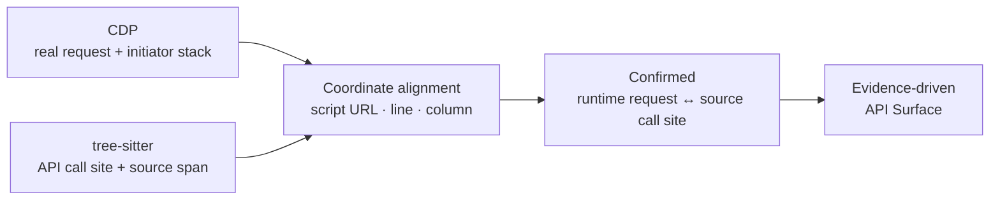

<div align="center">

# TraceSurface

**Dynamic browser tracing × JavaScript AST analysis. Reconstruct the complete API surface from JavaScript.**

[Quick Start](#quick-start) · [Case Study](#case-study-scanning-a-login-page) · [Capabilities](#capabilities) · [How It Works](#how-it-works) · [简体中文](https://github.com/pis10/TraceSurface/blob/main/README.md)

<p>
  
  <a href="https://github.com/pis10/TraceSurface/blob/main/LICENSE"></a>
</p>

</div>

TraceSurface is built for penetration testing, security assessment, and API inventory. Starting from one URL, it traces runtime traffic in a real browser while parsing JavaScript ASTs across entry scripts, lazy chunks, and micro-frontends. Initiator coordinates pin real requests back to source call sites, recovering base URLs and complete endpoints. TraceSurface then strips browser credentials and replays those requests to expose missing or weak authorization.

**Core principle: runtime requests confirm; static analysis expands. Every API carries evidence, and every inference tier has a reason.**

## Case Study: Scanning a Login Page

The target is the official RuoYi Vue login page. Without logging into the admin UI, recover the backend APIs from the frontend code:

```bash
tracesurface scan https://vue.ruoyi.vip/login
```


The page triggers only `GET /prod-api/captchaImage`, but that single request provides the decisive coordinates. TraceSurface aligns it precisely with the `/captchaImage` call site in `app.js`, establishes `/prod-api` as the prefix, then traverses the webpack entry and lazy chunks to recover APIs used only after login:


| Metric | Result |
| --- | --- |
| AST call sites | 316 (before dedup) |
| Recovered APIs | 135 (1 confirmed, 0 CDP-only, L1 125 · L2 3 · L3 3 · L4 3) |
| Frontend routes | 19 found, 19 visited |
| Requests replayed | 92 (88 2xx, 4 4xx) |
| Secret matches | 1 |
| Duration | 47.7s |

One captcha request becomes 135 APIs. Roles, menus, departments, dictionaries, monitoring, AI conversations — backend endpoints never triggered by the current page emerge directly from the frontend code.


> [!NOTE]
> 79 of the 88 2xx responses returned `code: 401` in the body.

## Capabilities

- **Real browser tracing**: captures Fetch/XHR, initiator stacks, scripts, routes, and micro-frontend entries as runtime evidence.
- **JavaScript AST extraction**: recognizes `fetch`, XHR, axios, custom wrappers, and gateway calls to recover endpoints the page never triggered.
- **Lazy-chunk traversal**: reconstructs webpack / Vite chunk maps and expands business code without waiting for manual navigation.
- **Stack-to-AST alignment**: binds CDP initiator coordinates to source call sites, confirming requests and recovering base URLs.
- **Evidence-driven inference**: grades URL derivations from L1 to L4, with every result traceable to evidence.
- **Credential-free verification**: strips Cookie, Authorization, and other credentials before replaying requests to expose authorization gaps.
- **Local report**: discovered APIs, unauthenticated replay results, and secret matches in one place.

## Quick Start

Download the archive for your platform from [GitHub Releases](https://github.com/pis10/TraceSurface/releases). Extract it and run the binary from its directory:

```bash
# macOS / Linux
./tracesurface scan https://target.example

# Windows PowerShell
.\tracesurface.exe scan https://target.example
```

TraceSurface prefers the locally installed Google Chrome. When Chrome is unavailable, the first scan downloads Chromium to `~/.tracesurface/browsers/`. Start the local report:

```bash
./tracesurface serve
```


Open `http://127.0.0.1:8765` in your browser.

For discovery without active replay:

```bash
./tracesurface scan https://target.example --no-replay
```

<details>
<summary>Install from source</summary>

Requires Python 3.12 and [uv](https://docs.astral.sh/uv/).

```bash
git clone https://github.com/pis10/TraceSurface.git
cd TraceSurface

uv sync
```

Then run everything with `uv run tracesurface ...`.

</details>

## Common Workflows

| Scenario | Command |
| --- | --- |
| Scan one target | `tracesurface scan https://target.example` |
| Discover without replay | `tracesurface scan https://target.example --no-replay` |
| Scan a target list | `tracesurface scan -f targets.txt -s 10` |
| Interact with a visible browser | `tracesurface scan https://target.example --headed --wait-ms 15000` |
| Save authentication state | `tracesurface login https://sso.example.com` |
| Disable stored authentication | `tracesurface scan https://target.example --no-auth` |
| Start the report | `tracesurface serve` |

`login` stores Playwright `storage_state` and optional `sessionStorage` in `~/.tracesurface/auth.json`. Later scans load it automatically.

Run `tracesurface scan --help` for the complete option list.

## Interpreting Unauthorized-Access Results

TraceSurface replays two kinds of requests: API candidates inferred from frontend source, and Fetch/XHR requests captured by the browser.

Replay keeps the URL, method, body, and Content-Type, but drops the browser's Cookie, Authorization, and other auth headers — what you get back is the unauthenticated view of the API. GET and POST are enabled by default; other methods require `--allow-destructive`.

One thing to remember when reading results: HTTP 2xx does not imply business success. Many endpoints answer unauthenticated requests with 200 and `code: 401` in the body. Draw conclusions from the response content and the intended authorization boundary.

## Report Views

| View | Purpose |
| --- | --- |
| **APIs** | Frontend-derived API inventory, including real browser requests |
| **Replays** | Unauthenticated replay requests, responses, status codes, and matches |
| **Secrets** | Sensitive information found in frontend artifacts, with context |

## How It Works

TraceSurface fuses runtime traffic and static call sites into one evidence chain: the browser pins down real URLs, the AST expands untriggered endpoints, and initiator coordinates bind the two together.

### Stack-to-AST Alignment

Every browser request carries its initiating script, line, and column; every AST call site has a matching source span. Once the coordinates hit, the runtime request and source call site become one confirmed API record.



1. CDP records the script, line, and column for Fetch/XHR requests.
2. tree-sitter extracts API call sites and source locations.
3. A coordinate match marks the request as Confirmed and can provide a base URL for other call sites.

### Evidence Tiers

Confirmed means a runtime request matched a source call site. L1–L4 describe the strength of other URL inferences.

| Tier | Meaning |
| --- | --- |
| **L1 Full** | Unique binding, or a full URL already present in source |
| **L2 Bound** | Bound through a client relationship or a limited candidate set |
| **L3 Global** | Uses a base URL already found on the site |
| **L4 Origin** | Falls back to the target origin |

## Data Directory

Data is stored in `~/.tracesurface/` by default. Set `TRACESURFACE_HOME` to use another location.

```text
~/.tracesurface/
├── tracesurface.db
├── responses/
├── sources/
├── logs/
├── browsers/       # fallback Chromium, created when needed
└── auth.json
```

## Stack

- Python, Typer, asyncio, httpx
- Playwright and Chrome DevTools Protocol
- tree-sitter and tree-sitter-javascript
- SQLite, FastAPI, and Uvicorn
- React, TypeScript, Vite, and Tailwind CSS

## Safety and Authorization

Use TraceSurface only on targets you own or are explicitly authorized to assess. Scans send GET and POST requests by default; `--allow-destructive` enables other methods. Use `--no-replay` when verification is not required.

## License

[MIT](./LICENSE)
