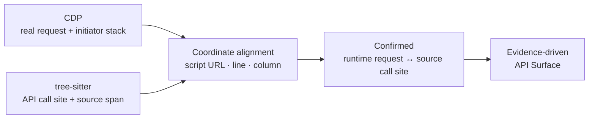

<div align="center">

# TraceSurface

**Find the APIs hiding in frontend code. Verify unauthorized access.**

Dynamic browser tracing meets JavaScript static analysis, built for SPAs and micro-frontends.

[Quick Start](#quick-start) · [Capabilities](#capabilities) · [How It Works](#how-it-works) · [简体中文](https://github.com/pis10/TraceSurface/blob/main/README.md)

<p>
  
  <a href="https://github.com/pis10/TraceSurface/blob/main/LICENSE"></a>
</p>

</div>

TraceSurface is an open-source tool for penetration testing, security assessment, and API asset inventory. Give it a site and it launches a real browser to collect frontend artifacts and routes, extracts hidden API calls from JavaScript, then replays requests without any captured authentication to surface unauthorized-access and weak-authorization risks.

It shines exactly where traditional content discovery falls short: endpoints that exist only in minified JS, lazy-loaded chunks, post-login routes, or runtime client configuration.


## Capabilities

- **API asset discovery**: combine browser traffic, HTML, JavaScript, webpack/Vite chunks, dynamic routes, and micro-frontend entries to reconstruct the API surface.
- **Optional login state**: scanning works fully without credentials; save and reuse browser state to go deeper into pages and frontend modules loaded only after login.
- **Unauthorized-access testing**: replay discovered APIs and real browser requests with no authentication material — Cookie, Authorization, and friends are never carried over.
- **Static call extraction**: recognize `fetch`, XHR, axios, configuration objects, custom wrappers, and argument-split gateway calls.
- **Evidence and confidence tiers**: retain call sites, runtime requests, baseURL sources, binding rules, and downgrade reasons for every result.
- **Local report**: inspect API Surface, Verification, Network, and Secrets without an external service.

## Quick Start

Requires Python 3.12+ and [uv](https://docs.astral.sh/uv/).

Install from the GitHub Release wheel (no Node.js needed):

```bash
uv tool install https://github.com/pis10/TraceSurface/releases/download/v1.0.0/tracesurface-1.0.0-py3-none-any.whl
tracesurface install-browser   # first run only, downloads Chromium
```

Scan a target you are authorized to assess:

```bash
tracesurface scan https://target.example
```

Start the local report:

```bash
tracesurface serve
```

Open `http://127.0.0.1:8765` in your browser.

For discovery without active replay:

```bash
tracesurface scan https://target.example --no-replay
```

<details>
<summary>Install from source</summary>

Requires Python 3.12, uv, and Node.js 20+.

```bash
git clone https://github.com/pis10/TraceSurface.git
cd TraceSurface

uv sync
uv run playwright install chromium

cd frontend
npm ci
npm run build   # output goes to tracesurface/server/static
cd ..
```

Then run everything with `uv run tracesurface ...`.

</details>


## Common Workflows

| Scenario | Command |
| --- | --- |
| Scan one target | `tracesurface scan https://target.example` |
| Discover without replay | `tracesurface scan https://target.example --no-replay` |
| Scan a target list | `tracesurface scan -f targets.txt -s 10` |
| Interact with a visible browser | `tracesurface scan https://target.example --headed --wait-ms 15000` |
| Save authentication state | `tracesurface login https://sso.example.com` |
| Disable stored authentication | `tracesurface scan https://target.example --no-auth` |
| Start the report | `tracesurface serve` |

`login` stores Playwright `storage_state` and optional `sessionStorage` in `~/.tracesurface/auth.json`. Later scans load it automatically.

Full `scan` options:


## Interpreting Unauthorized-Access Results

TraceSurface sends two kinds of inputs through the same unauthenticated replay pipeline:

1. API candidates inferred from frontend source.
2. Real Fetch/XHR requests observed in an authenticated browser session.

Real requests retain their method, body, and Content-Type, but captured authentication headers are never carried over. The report links the authenticated browser request to its unauthenticated replay, making it easy to prioritize endpoints that still return successful responses or sensitive data without credentials.

> [!NOTE]
> A `2xx` response means the endpoint remained reachable without the original authentication context; it is not automatically a vulnerability. Confirm the response content, business identity, and intended authorization boundary before reporting a finding.

## Report Views

| View | Purpose |
| --- | --- |
| **API Surface** | Resolved APIs, call sites, evidence tiers, and baseURL sources |
| **Verification** | Active replay requests, responses, status codes, and matches |
| **Network** | Real browser Fetch/XHR traffic, initiator stacks, and linked unauthenticated replay |
| **Secrets** | Sensitive information found in frontend artifacts, with context |

## How It Works

```text
URL
 └─ Collection   browser / CDP / routes / frontend artifacts / micro-frontends
     └─ Extraction   JavaScript / HTML AST → request, base, alias, and secret facts
         └─ Inference   runtime alignment / value graph / client identity graph → L1–L4
             └─ Storage   SQLite evidence model
                 └─ Replay   unauthenticated replay with evidence links
```

TraceSurface does not treat browser capture and JavaScript static analysis as unrelated datasets. Runtime requests become evidence for static inference, while static call sites extend coverage beyond the paths exercised in one browser session.

## Key Design: Stack-to-AST Alignment

Network capture observes real requests but rarely explains which source expression initiated them. Static analysis finds API call sites but does not know their final runtime URLs. TraceSurface connects the two through the JavaScript initiator stack.



1. CDP records the script URL, line, and column of initiator frames for every real Fetch/XHR request.
2. tree-sitter extracts API call sites with precise source spans.
3. A frame and a call site are aligned when the frame coordinate falls inside the call-site span in the same script.
4. Confirmed requests become the strongest evidence and anchor baseURL binding for unresolved static candidates.

### Evidence Tiers

| Tier | Meaning |
| --- | --- |
| **L1 Full** | CDP-confirmed, uniquely identity-bound, or already a full URL in source |
| **L2 Bound** | Bound through the client identity graph or deterministic bounded fan-out |
| **L3 Global** | Falls back to base URLs already discovered on the site |
| **L4 Origin** | Falls back to the target origin with the weakest evidence |

Every non-L1 result carries `why_not_higher_tier`, explaining which stronger evidence was missing.

## Data Directory

Data is stored in `~/.tracesurface/` by default. Set `TRACESURFACE_HOME` to use another location.

```text
~/.tracesurface/
├── tracesurface.db
├── responses/
├── sources/
└── auth.json
```

## Stack

- Python, Typer, asyncio, httpx
- Playwright and Chrome DevTools Protocol
- tree-sitter and tree-sitter-javascript
- SQLite, FastAPI, and Uvicorn
- React, TypeScript, Vite, and Tailwind CSS

## Safety and Authorization

Use TraceSurface only on targets you own or are explicitly authorized to assess. Scans perform active replay by default, and `POST` or unknown methods may change data on the target system. Use `--no-replay` when verification is not required.

## License

[MIT](./LICENSE)
