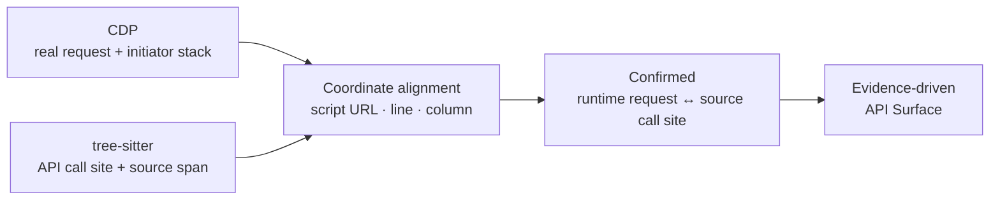

<div align="center">

# TraceSurface

**Find the APIs hiding in frontend code. Verify unauthorized access.**

Dynamic browser tracing meets JavaScript AST analysis. Traffic and source confirm each other — one URL in, the full frontend API surface out.

[Quick Start](#quick-start) · [Case Study](#case-study-login-page-only) · [Capabilities](#capabilities) · [How It Works](#how-it-works) · [简体中文](https://github.com/pis10/TraceSurface/blob/main/README.md)

<p>
  
  <a href="https://github.com/pis10/TraceSurface/blob/main/LICENSE"></a>
</p>

</div>

TraceSurface is built for penetration testing, security assessment, and API inventory. It collects frontend assets in a real browser, pulls API call sites out of JavaScript with tree-sitter, and resolves final URLs against real requests captured over CDP. The two signals complete each other: what the traffic never triggered, the source still reveals; what the source can't fully resolve, the traffic pins down. Candidates are then replayed without browser credentials to check for missing or weak authorization.

## Case Study: Login Page Only

Take the official RuoYi Vue demo. The entry point is the login page — no credentials, no clicking into the admin UI:

```bash
tracesurface scan https://vue.ruoyi.vip/login
```


The login page requests `GET /prod-api/captchaImage` on its own. TraceSurface aligns that request with the `/captchaImage` call site in `app.js`, confirms `/prod-api` as the API prefix, and keeps digging through entry scripts and webpack lazy chunks:


About 61 seconds later:

| Metric | Result |
| --- | --- |
| AST call sites | 316 (before dedup) |
| Resolved APIs | 135 (1 Confirmed, 134 across L1–L4) |
| Frontend routes | 19 found, 19 visited |
| Requests replayed | 92 (88 2xx, 4 4xx) |
| Secret matches | 1 |

The result goes far beyond captcha and login — roles, menus, departments, dictionaries, monitoring, AI conversations: the admin modules' APIs all come back from a single login page.


> [!NOTE]
> 79 of the 88 2xx responses returned `code: 401` in the body. HTTP 2xx means the request was accepted, not that it succeeded — read the response before calling it unauthorized access.

## Capabilities

- **Real browser collection**: captures Fetch/XHR, initiator stacks, scripts, routes, and micro-frontend entries — everything the browser sees.
- **AST extraction**: parses JavaScript with tree-sitter to recognize `fetch`, XHR, axios, custom wrappers, and gateway calls.
- **Lazy-chunk discovery**: reads webpack / Vite chunk maps and fetches business chunks directly instead of waiting for the page to trigger them.
- **Runtime calibration**: aligns CDP initiator stacks with source call sites to confirm requests and infer base URLs.
- **Evidence tiers**: labels inferred URLs from L1 to L4, so every conclusion carries its own justification.
- **Credential-free replay**: resends requests without Cookie, Authorization, or other browser headers — the attacker's view of the API.
- **Local report**: APIs, real traffic, replay results, and secret matches in one local UI.

## Quick Start

Requires Python 3.12+ and [uv](https://docs.astral.sh/uv/).

Install from the GitHub Release wheel (no Node.js needed):

```bash
uv tool install https://github.com/pis10/TraceSurface/releases/download/v1.0.0/tracesurface-1.0.0-py3-none-any.whl
tracesurface install-browser   # first run only, downloads Chromium
```

Scan a target:

```bash
tracesurface scan https://target.example
```

Start the local report:

```bash
tracesurface serve
```


Open `http://127.0.0.1:8765` in your browser.

For discovery without active replay:

```bash
tracesurface scan https://target.example --no-replay
```

<details>
<summary>Install from source</summary>

Requires Python 3.12, uv, and Node.js 20+.

```bash
git clone https://github.com/pis10/TraceSurface.git
cd TraceSurface

uv sync
uv run playwright install chromium

cd frontend
npm ci
npm run build   # output goes to tracesurface/server/static
cd ..
```

Then run everything with `uv run tracesurface ...`.

</details>


## Common Workflows

| Scenario | Command |
| --- | --- |
| Scan one target | `tracesurface scan https://target.example` |
| Discover without replay | `tracesurface scan https://target.example --no-replay` |
| Scan a target list | `tracesurface scan -f targets.txt -s 10` |
| Interact with a visible browser | `tracesurface scan https://target.example --headed --wait-ms 15000` |
| Save authentication state | `tracesurface login https://sso.example.com` |
| Disable stored authentication | `tracesurface scan https://target.example --no-auth` |
| Start the report | `tracesurface serve` |

`login` stores Playwright `storage_state` and optional `sessionStorage` in `~/.tracesurface/auth.json`. Later scans load it automatically.

Full `scan` options:


## Interpreting Unauthorized-Access Results

TraceSurface replays two kinds of requests: API candidates inferred from frontend source, and Fetch/XHR requests captured by the browser.

Replay keeps the URL, method, body, and Content-Type, but drops the browser's Cookie, Authorization, and other auth headers — what you get back is the unauthenticated view of the API. GET and POST are enabled by default; other methods require `--allow-destructive`.

One thing to remember when reading results: HTTP 2xx does not imply business success. Many endpoints answer unauthenticated requests with 200 and `code: 401` in the body. Draw conclusions from the response content and the intended authorization boundary.

## Report Views

| View | Purpose |
| --- | --- |
| **API Surface** | Resolved frontend API candidates, call sites, evidence tiers, and baseURL sources |
| **Verification** | Active replay requests, responses, status codes, and matches |
| **Network** | Real browser Fetch/XHR traffic, initiator stacks, and linked unauthenticated replay |
| **Secrets** | Sensitive information found in frontend artifacts, with context |

## How It Works

```text
URL
 └─ Collection   browser / CDP / routes / frontend artifacts / micro-frontends
     └─ Extraction   JavaScript / HTML AST → request, base, alias, and secret facts
         └─ Inference   runtime alignment / value graph / client identity graph → L1–L4
             └─ Storage   SQLite evidence model
                 └─ Replay   unauthenticated replay with evidence links
```

Runtime requests provide real URLs for static analysis, while static call sites cover APIs that one browser session did not trigger.

## Key Design: Stack-to-AST Alignment

Network capture knows where a request went; static analysis knows where it was written. TraceSurface connects them through the JavaScript initiator stack.



1. CDP records the script, line, and column for Fetch/XHR requests.
2. tree-sitter extracts API call sites and source locations.
3. A coordinate match marks the request as Confirmed and can provide a base URL for other call sites.

### Evidence Tiers

Confirmed means a runtime request matched a source call site. L1–L4 describe the strength of other URL inferences.

| Tier | Meaning |
| --- | --- |
| **L1 Full** | Unique binding, or a full URL already present in source |
| **L2 Bound** | Bound through a client relationship or a limited candidate set |
| **L3 Global** | Uses a base URL already found on the site |
| **L4 Origin** | Falls back to the target origin |

## Data Directory

Data is stored in `~/.tracesurface/` by default. Set `TRACESURFACE_HOME` to use another location.

```text
~/.tracesurface/
├── tracesurface.db
├── responses/
├── sources/
└── auth.json
```

## Stack

- Python, Typer, asyncio, httpx
- Playwright and Chrome DevTools Protocol
- tree-sitter and tree-sitter-javascript
- SQLite, FastAPI, and Uvicorn
- React, TypeScript, Vite, and Tailwind CSS

## Safety and Authorization

Use TraceSurface only on targets you own or are explicitly authorized to assess. Scans send GET and POST requests by default; `--allow-destructive` enables other methods. Use `--no-replay` when verification is not required.

## License

[MIT](./LICENSE)
