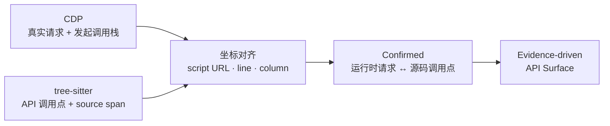

<div align="center">

# TraceSurface

**发现藏在前端代码里的 API，验证未授权访问风险。**

动态浏览器追踪 × JavaScript AST 分析。动静结合，从JS中还原完整的API。

[快速开始](#快速开始) · [实战](#实战只扫登录页) · [核心能力](#核心能力) · [工作原理](#工作原理) · [English](https://github.com/pis10/TraceSurface/blob/main/README.en.md)

<p>
  
  <a href="https://github.com/pis10/TraceSurface/blob/main/LICENSE"></a>
</p>

</div>

TraceSurface 面向渗透测试、安全评估与 API 资产盘点。从一个 URL 出发，它同时追踪浏览器运行时流量、解析 JavaScript AST。调用栈坐标将动静两端精确对齐，补全 baseURL，挖出页面从未触发的 API；无认证重放随后验证未授权与弱鉴权。

**核心原则：真实请求负责确认，静态分析负责扩展；每条 API 都有证据，每层推导都有依据。**

## 实战演示：扫描站点登录页

目标是若依官方 Vue 登录页，不登录后台管理，从前端代码里挖出所有后台 API：

```bash
tracesurface scan https://vue.ruoyi.vip/login
```


页面运行时只触发了 `GET /prod-api/captchaImage`，但这一条请求已经给出关键坐标。TraceSurface 将它精确对齐到 `app.js` 里的 `/captchaImage` 调用点，锁定 `/prod-api`，随后穿透 webpack 入口和懒加载 Chunk，继续还原登录后才会使用的后台 API：


| 指标 | 结果 |
| --- | --- |
| AST 调用点 | 316（去重前） |
| 还原出的 API | 135（已确认 1，仅 CDP 0，L1 125 · L2 3 · L3 3 · L4 3） |
| 前端路由 | 发现 19，访问 19 |
| 重放请求 | 92（2xx 88，4xx 4） |
| 敏感信息命中 | 1 |
| 耗时 | 47.7s |

一个验证码请求，最终还原出 135 个 API。角色、菜单、部门、字典、监控、AI 会话——这些当前页面从未触发的后台接口，被一并挖了出来。


> [!NOTE]
> 88 条 2xx 里，有 79 条在响应体返回了 `code: 401`。

## 核心能力

- **真实浏览器追踪**：捕获 Fetch/XHR、发起调用栈、脚本、路由与微前端入口，拿到页面真实运行证据。
- **JavaScript AST 深挖**：识别 `fetch`、XHR、axios、自定义封装与网关调用，从代码中找回未触发接口。
- **懒加载穿透**：还原 webpack / Vite Chunk 映射，主动展开业务代码，不等用户逐页点击。
- **Stack-to-AST 对齐**：将 CDP 发起栈精确绑定源码调用点，确认请求并还原 baseURL。
- **证据驱动推导**：以 L1–L4 标注 URL 的推导强度，每个结果都能回到证据。
- **无认证验证**：剥离 Cookie、Authorization 等认证信息重放请求，直击未授权与弱鉴权。
- **本地报告**：发现的 API、无认证重放结果与敏感信息集中呈现。

## 快速开始

从 [GitHub Releases](https://github.com/pis10/TraceSurface/releases) 下载对应平台的压缩包，解压后在文件所在目录运行：

```bash
# macOS / Linux
./tracesurface scan https://target.example

# Windows PowerShell
.\tracesurface.exe scan https://target.example
```

TraceSurface 优先使用本机 Google Chrome。未检测到 Chrome 时，首次扫描会自动下载 Chromium 到 `~/.tracesurface/browsers/`。启动本地报告：

```bash
./tracesurface serve
```


浏览器打开 `http://127.0.0.1:8765`。

只想发现 API、不执行主动重放：

```bash
./tracesurface scan https://target.example --no-replay
```

<details>
<summary>从源码安装</summary>

要求 Python 3.12 和 [uv](https://docs.astral.sh/uv/)。

```bash
git clone https://github.com/pis10/TraceSurface.git
cd TraceSurface

uv sync
```

之后用 `uv run tracesurface ...` 运行。

</details>

## 常见用法

| 场景 | 命令 |
| --- | --- |
| 扫描单个站点 | `tracesurface scan https://target.example` |
| 只发现、不重放 | `tracesurface scan https://target.example --no-replay` |
| 批量扫描 | `tracesurface scan -f targets.txt -s 10` |
| 打开浏览器手动触发页面 | `tracesurface scan https://target.example --headed --wait-ms 15000` |
| 保存登录态 | `tracesurface login https://sso.example.com` |
| 强制不加载登录态 | `tracesurface scan https://target.example --no-auth` |
| 启动报告 | `tracesurface serve` |

`login` 会把 Playwright `storage_state` 和可选的 `sessionStorage` 保存到 `~/.tracesurface/auth.json`，后续扫描默认自动加载。

运行 `tracesurface scan --help` 查看 `scan` 的完整参数。

## 如何解读未授权结果

TraceSurface 会重放两类请求：从前端源码推导出的 API 候选，以及浏览器捕获到的 Fetch/XHR 请求。

重放保留 URL、method、body 和 Content-Type，但不带浏览器里的 Cookie、Authorization 等认证头——拿到的就是未授权视角下的真实响应。默认只发送 GET 和 POST；其他方法需显式使用 `--allow-destructive`。

判断结果时记住一点：HTTP 2xx 不等于业务成功。不少接口对未授权请求也返回 200，只是在响应体里给 `code: 401`。结合响应内容和权限边界下结论。

## 报告视图

| 视图 | 用途 |
| --- | --- |
| **APIs** | 从前端还原出的接口清单，包含浏览器真实打过的请求 |
| **Replays** | 无认证重放的请求、响应、状态码与命中结果 |
| **Secrets** | 前端产物中的敏感信息命中与上下文 |

## 工作原理

TraceSurface 把运行时流量与静态调用点合成一条证据链：浏览器锁定真实 URL，AST 展开未触发接口，调用栈坐标负责把二者钉在一起。

### Stack-to-AST Alignment

每条浏览器请求都带着发起脚本、行号与列号；每个 AST 调用点也有对应的 source span。坐标一旦命中，真实请求与源码调用点就被确认为同一条 API 证据。



1. CDP 记录 Fetch/XHR 的脚本、行号和列号。
2. tree-sitter 提取 API 调用点及源码位置。
3. 坐标命中后，请求被标记为 Confirmed，并可为其他调用点提供 baseURL。

### 证据层级

Confirmed 表示运行时请求已命中源码调用点；L1–L4 表示其他 URL 的推导强度。

| 层级 | 含义 |
| --- | --- |
| **L1 Full** | 唯一绑定，或源码中已有完整 URL |
| **L2 Bound** | 通过 client 关系或有限候选绑定 |
| **L3 Global** | 使用站点内已发现的 baseURL |
| **L4 Origin** | 回退到目标站点 origin |

## 数据目录

数据默认保存在 `~/.tracesurface/`，可以通过 `TRACESURFACE_HOME` 指定其他目录。

```text
~/.tracesurface/
├── tracesurface.db
├── responses/
├── sources/
├── logs/
├── browsers/       # 备用 Chromium（按需）
└── auth.json
```

## 技术栈

- Python、Typer、asyncio、httpx
- Playwright、Chrome DevTools Protocol
- tree-sitter、tree-sitter-javascript
- SQLite、FastAPI、Uvicorn
- React、TypeScript、Vite、Tailwind CSS

## 安全与授权

TraceSurface 只应用于你拥有或已获得明确授权的目标。扫描默认会主动发送 GET 和 POST；`--allow-destructive` 会放行其他方法。不需要验证时请使用 `--no-replay`。

## License

[MIT](./LICENSE)
