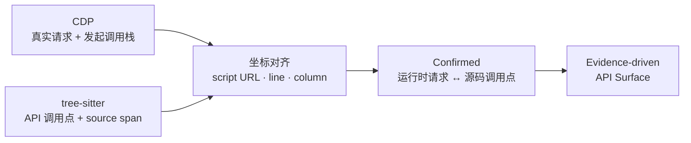

<div align="center">

# TraceSurface

**发现藏在前端代码里的 API，验证未授权访问风险。**

动态浏览器追踪 × JavaScript 静态分析，为 SPA 与微前端应用而生。

[快速开始](#快速开始) · [核心能力](#核心能力) · [工作原理](#工作原理) · [English](https://github.com/pis10/TraceSurface/blob/main/README.en.md)

<p>
  
  <a href="https://github.com/pis10/TraceSurface/blob/main/LICENSE"></a>
</p>

</div>

TraceSurface 是一款面向渗透测试、安全评估与 API 资产盘点的开源工具。给它一个站点，它会启动真实浏览器收集前端产物与路由，从 JavaScript 中提取隐藏的 API 调用，再做去除认证信息的主动重放，帮助定位未授权访问与弱鉴权问题。

传统目录扫描覆盖不到的角落——只存在于压缩后的 JS、懒加载 chunk、登录后路由或运行时 client 配置里的接口——正是它擅长的场景。


## 核心能力

- **API 资产发现**：综合浏览器网络流量、HTML、JavaScript、webpack/Vite chunk、动态路由与微前端入口，还原尽可能完整的 API 面。
- **可选登录态**：无需登录即可扫描；保存并复用浏览器登录态后，可深入认证后才加载的业务页面与前端模块。
- **未授权检测**：对发现的 API 与浏览器真实请求做去认证重放——请求不携带 Cookie、Authorization 等任何认证信息。
- **静态调用提取**：识别 `fetch`、XHR、axios、配置对象、自定义封装，以及参数拆分的网关调用。
- **证据链与置信分层**：每条结果都保留调用点、运行时请求、baseURL 来源、绑定规则和降级原因。
- **本地报告**：统一查看 API Surface、Verification、Network 与 Secrets，不依赖外部服务。

## 快速开始

要求 Python 3.12+ 和 [uv](https://docs.astral.sh/uv/)。

从 GitHub Release 安装（无需 Node.js）：

```bash
uv tool install https://github.com/pis10/TraceSurface/releases/download/v1.0.0/tracesurface-1.0.0-py3-none-any.whl
tracesurface install-browser   # 仅首次需要，下载 Chromium
```

扫描一个已获授权的站点：

```bash
tracesurface scan https://target.example
```

启动本地报告：

```bash
tracesurface serve
```

浏览器打开 `http://127.0.0.1:8765`。

只想发现 API、不执行主动重放：

```bash
tracesurface scan https://target.example --no-replay
```

<details>
<summary>从源码安装</summary>

要求 Python 3.12、uv 和 Node.js 20+。

```bash
git clone https://github.com/pis10/TraceSurface.git
cd TraceSurface

uv sync
uv run playwright install chromium

cd frontend
npm ci
npm run build   # 产物输出到 tracesurface/server/static
cd ..
```

之后用 `uv run tracesurface ...` 运行。

</details>


## 常见用法

| 场景 | 命令 |
| --- | --- |
| 扫描单个站点 | `tracesurface scan https://target.example` |
| 只发现、不重放 | `tracesurface scan https://target.example --no-replay` |
| 批量扫描 | `tracesurface scan -f targets.txt -s 10` |
| 打开浏览器手动触发页面 | `tracesurface scan https://target.example --headed --wait-ms 15000` |
| 保存登录态 | `tracesurface login https://sso.example.com` |
| 强制不加载登录态 | `tracesurface scan https://target.example --no-auth` |
| 启动报告 | `tracesurface serve` |

`login` 会把 Playwright `storage_state` 和可选的 `sessionStorage` 保存到 `~/.tracesurface/auth.json`，后续扫描默认自动加载。

`scan` 的完整参数：


## 如何解读未授权结果

TraceSurface 会把两类对象送入同一套去认证重放流程：

1. 从前端源码推导出的 API 候选。
2. 浏览器在登录态下真实发出的 Fetch/XHR 请求。

真实请求会保留 method、body 和 Content-Type，但认证头不会被携带。报告会把登录态下的原始请求与无认证重放结果关联展示，方便快速筛出去认证后仍返回成功响应或敏感数据的接口。

> [!NOTE]
> `2xx` 只能说明接口在无认证信息时仍然可达，不一定等同于漏洞。最终结论仍需结合响应内容、业务身份和权限边界确认。

## 报告视图

| 视图 | 用途 |
| --- | --- |
| **API Surface** | 查看完整 API 面、调用点、证据层级和 baseURL 来源 |
| **Verification** | 查看主动重放的请求、响应、状态码与命中结果 |
| **Network** | 查看浏览器真实 Fetch/XHR、发起调用栈及对应的无认证重放 |
| **Secrets** | 查看前端产物中的敏感信息命中与上下文 |

## 工作原理

```text
URL
 └─ Collection   浏览器 / CDP / 路由 / 前端产物 / 微前端
     └─ Extraction   JavaScript / HTML AST → request、base、alias、secret facts
         └─ Inference   运行时对齐 / 值解析图 / client 身份图 → L1–L4
             └─ Storage   SQLite 证据模型
                 └─ Replay   去认证重放与结果回链
```

TraceSurface 不把"浏览器抓包"和"JavaScript 静态分析"当作两份互不相关的数据。运行时请求会成为静态推导的证据，静态调用点则补足单次浏览行为无法覆盖的 API。

## 关键设计：Stack-to-AST Alignment

网络抓包能看到真实请求，却很难说明它来自源码中的哪一处；静态分析能找到 API 调用点，却不知道运行时最终请求了哪个 URL。TraceSurface 用 JavaScript 发起调用栈把两者对齐。



1. CDP 为每条真实 Fetch/XHR 保存发起栈帧的脚本 URL、行号和列号。
2. tree-sitter 提取 API 调用点，并记录它在源码中的精确位置区间。
3. 当栈帧坐标落入同一脚本的调用点区间时，两者被认定为同一处调用。
4. 已确认请求成为最强证据，为其余静态候选的 baseURL 绑定与分层推导提供锚点。

### 证据层级

| 层级 | 含义 |
| --- | --- |
| **L1 Full** | CDP 运行时确认、唯一身份绑定，或源码中存在完整 URL |
| **L2 Bound** | client 身份图绑定，或确定性的有限候选扇出 |
| **L3 Global** | 使用站点内已经发现的 baseURL 集合回退推导 |
| **L4 Origin** | 仅能使用目标站点 origin，证据最弱 |

未进入 L1 的结果会携带 `why_not_higher_tier`，说明缺少了哪一类更强证据。

## 数据目录

数据默认保存在 `~/.tracesurface/`，可以通过 `TRACESURFACE_HOME` 指定其他目录。

```text
~/.tracesurface/
├── tracesurface.db
├── responses/
├── sources/
└── auth.json
```

## 技术栈

- Python、Typer、asyncio、httpx
- Playwright、Chrome DevTools Protocol
- tree-sitter、tree-sitter-javascript
- SQLite、FastAPI、Uvicorn
- React、TypeScript、Vite、Tailwind CSS

## 安全与授权

TraceSurface 只应用于你拥有或已获得明确授权的目标。扫描默认会执行主动重放，其中 `POST` 或未知方法可能改变目标系统的数据；不需要验证时请使用 `--no-replay`。

## License

[MIT](./LICENSE)
