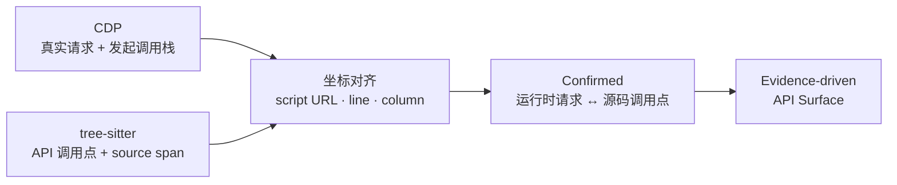

<div align="center">

# TraceSurface

**发现藏在前端代码里的 API，验证未授权访问风险。**

动态浏览器追踪 × JavaScript AST 分析。流量与源码相互印证，从一个 URL 还原完整的前端 API 攻击面。

[快速开始](#快速开始) · [实战](#实战只扫登录页) · [核心能力](#核心能力) · [工作原理](#工作原理) · [English](https://github.com/pis10/TraceSurface/blob/main/README.en.md)

<p>
  
  <a href="https://github.com/pis10/TraceSurface/blob/main/LICENSE"></a>
</p>

</div>

TraceSurface 面向渗透测试、安全评估与 API 资产盘点。它用真实浏览器收集前端资源，用 tree-sitter 从 JavaScript 里提取 API 调用点，再拿 CDP 捕获的真实请求校准 URL。两条线索互相补足：流量里没出现的接口，代码里有；代码里看不全的地址，流量能补。找到的候选接口还会去掉浏览器认证信息重放一遍，用来验证未授权访问和弱鉴权。

## 实战：只扫登录页

拿若依官方 Vue 演示站做个实验。入口就是登录页，不给登录态，也不点进后台：

```bash
tracesurface scan https://vue.ruoyi.vip/login
```


登录页自己会请求 `GET /prod-api/captchaImage`。TraceSurface 把这条请求和 `app.js` 里的 `/captchaImage` 调用点对齐，确认 `/prod-api` 是接口前缀，然后顺着入口脚本和 webpack 懒加载 chunk 继续往下挖：


大约 61 秒后：

| 指标 | 结果 |
| --- | --- |
| AST 调用点 | 316（去重前） |
| 解析出的 API | 135（Confirmed 1，L1–L4 共 134） |
| 前端路由 | 发现 19，访问 19 |
| 重放请求 | 92（2xx 88，4xx 4） |
| 敏感信息命中 | 1 |

结果远不止验证码和登录接口——角色、菜单、部门、字典、监控、AI 会话，后台模块的 API 都从一个登录页里还原了出来。


> [!NOTE]
> 88 条 2xx 里，有 79 条在响应体返回了 `code: 401`。HTTP 2xx 只代表请求被受理，不代表业务成功，判断未授权访问还要看响应内容。

## 核心能力

- **真实浏览器采集**：记录 Fetch/XHR、发起调用栈、脚本、路由和微前端入口，看到的就是浏览器看到的一切。
- **AST 接口提取**：用 tree-sitter 解析 JavaScript，识别 `fetch`、XHR、axios、自定义封装和网关调用。
- **懒加载发现**：解析 webpack / Vite 的 chunk 映射，主动拉取业务 chunk，不被动等页面触发。
- **运行时校准**：把 CDP 发起栈对齐到源码调用点，确认请求并推导 baseURL。
- **证据分层**：推导出的 URL 按 L1–L4 标注依据和可信度，每条结论都有出处。
- **无认证重放**：去掉 Cookie、Authorization 等请求头重新发送，从攻击者视角验证接口。
- **本地报告**：API、真实流量、重放结果和敏感信息，收在一个本地页面里看。

## 快速开始

从 GitHub Release 下载对应平台的 v1.0.5 压缩包：

| 平台 | 下载 |
| --- | --- |
| Windows x64 | [tracesurface-windows-x86_64.zip](https://github.com/pis10/TraceSurface/releases/download/v1.0.5/tracesurface-windows-x86_64.zip) |
| macOS Apple Silicon | [tracesurface-macos-arm64.tar.gz](https://github.com/pis10/TraceSurface/releases/download/v1.0.5/tracesurface-macos-arm64.tar.gz) |
| Linux x64 | [tracesurface-linux-x86_64.tar.gz](https://github.com/pis10/TraceSurface/releases/download/v1.0.5/tracesurface-linux-x86_64.tar.gz) |

解压后，在文件所在目录运行：

```bash
# macOS / Linux
./tracesurface scan https://target.example

# Windows PowerShell
.\tracesurface.exe scan https://target.example
```

TraceSurface 优先使用本机 Google Chrome。未检测到 Chrome 时，首次扫描会自动下载 Chromium 到 `~/.tracesurface/browsers/`。启动本地报告：

```bash
./tracesurface serve
```


浏览器打开 `http://127.0.0.1:8765`。

只想发现 API、不执行主动重放：

```bash
./tracesurface scan https://target.example --no-replay
```

<details>
<summary>从源码安装</summary>

要求 Python 3.12、uv 和 Node.js 20+。

```bash
git clone https://github.com/pis10/TraceSurface.git
cd TraceSurface

uv sync

cd frontend
npm ci
npm run build   # 产物输出到 tracesurface/server/static
cd ..
```

之后用 `uv run tracesurface ...` 运行。

</details>


## 常见用法

| 场景 | 命令 |
| --- | --- |
| 扫描单个站点 | `tracesurface scan https://target.example` |
| 只发现、不重放 | `tracesurface scan https://target.example --no-replay` |
| 批量扫描 | `tracesurface scan -f targets.txt -s 10` |
| 打开浏览器手动触发页面 | `tracesurface scan https://target.example --headed --wait-ms 15000` |
| 保存登录态 | `tracesurface login https://sso.example.com` |
| 强制不加载登录态 | `tracesurface scan https://target.example --no-auth` |
| 启动报告 | `tracesurface serve` |

`login` 会把 Playwright `storage_state` 和可选的 `sessionStorage` 保存到 `~/.tracesurface/auth.json`，后续扫描默认自动加载。

`scan` 的完整参数：


## 如何解读未授权结果

TraceSurface 会重放两类请求：从前端源码推导出的 API 候选，以及浏览器捕获到的 Fetch/XHR 请求。

重放保留 URL、method、body 和 Content-Type，但不带浏览器里的 Cookie、Authorization 等认证头——拿到的就是未授权视角下的真实响应。默认只发送 GET 和 POST；其他方法需显式使用 `--allow-destructive`。

判断结果时记住一点：HTTP 2xx 不等于业务成功。不少接口对未授权请求也返回 200，只是在响应体里给 `code: 401`。结合响应内容和权限边界下结论。

## 报告视图

| 视图 | 用途 |
| --- | --- |
| **API Surface** | 查看解析后的前端 API 候选、调用点、证据层级和 baseURL 来源 |
| **Verification** | 查看主动重放的请求、响应、状态码与命中结果 |
| **Network** | 查看浏览器真实 Fetch/XHR、发起调用栈及对应的无认证重放 |
| **Secrets** | 查看前端产物中的敏感信息命中与上下文 |

## 工作原理

```text
URL
 └─ Collection   浏览器 / CDP / 路由 / 前端产物 / 微前端
     └─ Extraction   JavaScript / HTML AST → request、base、alias、secret facts
         └─ Inference   运行时对齐 / 值解析图 / client 身份图 → L1–L4
             └─ Storage   SQLite 证据模型
                 └─ Replay   去认证重放与结果回链
```

运行时请求为静态分析提供真实 URL，静态调用点则补足单次浏览没有触发的 API。

## 关键设计：Stack-to-AST Alignment

抓包知道请求去了哪里，静态分析知道请求写在哪里。TraceSurface 用 JavaScript 发起栈把两者对齐。



1. CDP 记录 Fetch/XHR 的脚本、行号和列号。
2. tree-sitter 提取 API 调用点及源码位置。
3. 坐标命中后，请求被标记为 Confirmed，并可为其他调用点提供 baseURL。

### 证据层级

Confirmed 表示运行时请求已命中源码调用点；L1–L4 表示其他 URL 的推导强度。

| 层级 | 含义 |
| --- | --- |
| **L1 Full** | 唯一绑定，或源码中已有完整 URL |
| **L2 Bound** | 通过 client 关系或有限候选绑定 |
| **L3 Global** | 使用站点内已发现的 baseURL |
| **L4 Origin** | 回退到目标站点 origin |

## 数据目录

数据默认保存在 `~/.tracesurface/`，可以通过 `TRACESURFACE_HOME` 指定其他目录。

```text
~/.tracesurface/
├── tracesurface.db
├── responses/
├── sources/
├── browsers/
└── auth.json
```

## 技术栈

- Python、Typer、asyncio、httpx
- Playwright、Chrome DevTools Protocol
- tree-sitter、tree-sitter-javascript
- SQLite、FastAPI、Uvicorn
- React、TypeScript、Vite、Tailwind CSS

## 安全与授权

TraceSurface 只应用于你拥有或已获得明确授权的目标。扫描默认会主动发送 GET 和 POST；`--allow-destructive` 会放行其他方法。不需要验证时请使用 `--no-replay`。

## License

[MIT](./LICENSE)
